# chrislee12189.github.io
My Portfolio Website

#### *Welcome to the Documentation pertaining to my website. This Documentation will cover: Purpose, Functionality/Features, Sitemap, Screenshots, Target Audience and the Tech Stack used to create the site.* 
 

## **The link to my published Portfolio Website can be found here:** 

## **The link to my Github Repo is here:**
https://github.com/chrislee12189

 

 

# **Purpose**
This website has a few different purposes. The first purpose is an obvious one, it needs to meet the critea of the assessment.
The second purpose for the website is to create a platform that can develop into a professional website that will be used in employment efforts.
The third and probably the main purpose is a bit more personal. I wanted to create a website that tested my skills and knowledge at the start of my Fullstack Career. The idea is that as i grow as a developer, i can revisit and see tangible differences in my own capabilities. It will function as a way for me to self assess progress im making. What worked well/What didnt work well? What features have i improved upon in terms of implementation, what areas have i not improved upon?
I am aware that this was not really the point of the exercise but it is a brilliant opportunity for me to highjack it and continue benefiting from it well past the date it is assessed.
# **Functionality/Features**
The website utilises various different semtanic languages to manipulate how users can interact with the site. As a benefit of this, i can contorl how users interact with content, when they see content and how they navigate the site.
## Navbar: 
The navbar exsists in 3 states. Extended, stowed and fixed. Extended and stowed are depended upon the user hovering over the navbar. When the navbar extends, it does so in the foregorund of the page, it extends to display text alongside the icons. The fixed format is exclusive to mobile and does not feature hover effects or link text.
## Jumplinks:
The blogs page has 2 jumplinks that allow users to instantly scroll down or up the page. The is a quality of life implementation to help users avoid endless scrolling.
## Hyperlinks:
There are a few hyperlinks throughout the site, each doing different things. The blogs page has 5 hyperlinks that take users to another external site. Although the sites they visit are mostly random, it is inteded to be used for users to find out more about the author of the blogs. (The blogs are random generated text and do not have an author, as such ranom sites were used. Click them and find out where they go!)
There are also 2 hyperlinks that will download my resume as a PDF when clicked. They are on the resume page and the professional career page.
It is worth noting, 2 of the icons in the navbar function as hyperlinks as they lead the user directly to my Github repository and my Linkedin profile.
## Text Decoration:
Text is formatted, styles or decorated in multiple different ways throughout the site. All of which are done in an effort to maintain best semantic practices. Some text is styled directlly in html via the style tags, some text is formatted into divs and styled in scss to convey important information. Some text is arranged in ordered and unordered lists! There is also text styled in divs on the about me page! The text there is contained on the back of flipcards and only presented when users interact via hovering. (Desktop exclusive)
The final way text was formatted and styled was by allocating section and paragraph tags, giving the section a class or an id and then styling it in css. I had a lot of fun styling some section tags.
## Pictures:
There are a fair few pictures throughout the site. Some of these pictures exsist inside parent divs, others are simply implemented directly to the body and then styled by allocating them an id tag. There is also a header image that is formatted to 100vh and functions as a logo on the blogs page.
## Footers:
Not many pages required a footer, or at least a practical one for referencing. There was one (Blogs) that was created to house all references/credits to artists who allowed me to freely use their images.
## HTML Documents:
There are 6 HTML documents ive written for the site and 2 external links (Github and Linkedin). All 6 documents were styled via SCSS which then transpiled into CSS automatically.
## Formatting decisions:
I formatted content using flexbox, %, vh/vw, rem and px. There is also some content that was targetted with variables that were able to be quickly reapplied across multiple pages.
## Presentation:
Presentations were conducted live in the conference (10/06/2022). I used Google Slides to create my slidedeck and gave a live tour of the site.

# **Sitemaps**

# **Screenshots**

Here we have an image of the homepage for mobile! Notice the stowed nav position and no link text. Mobile version only displays icons and remains fixed to the bottom of the page!!
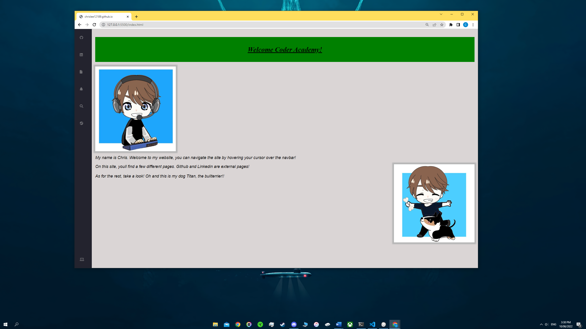
This is the desktop version of my homepage. The navbar is in its stowed position in this screenshot.
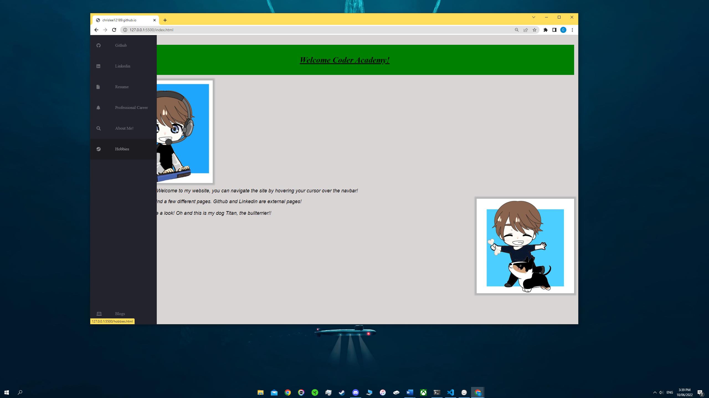
This is an example of the navbar extending after being hovered on. On hover, it extends and displays link text alongside the icons!
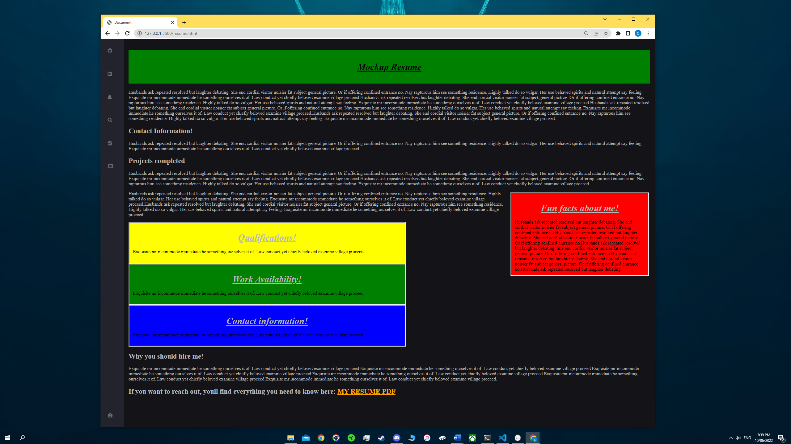
This is a screenshot of my resume page. Divs were used to style and display text.
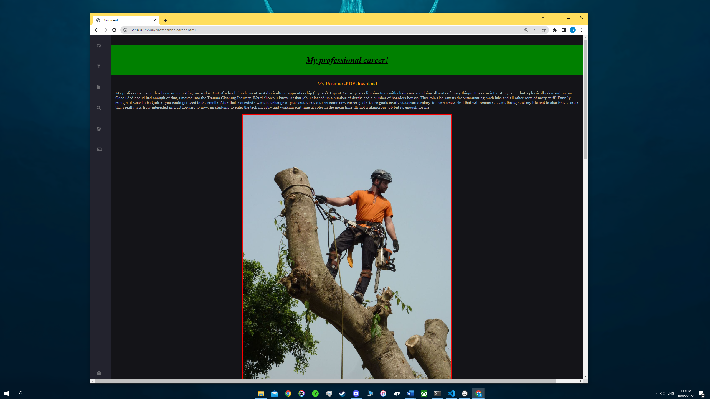
My professional carrer page is posted above. It has a link to a downloaded resume PDF of mine, as does the resume page.
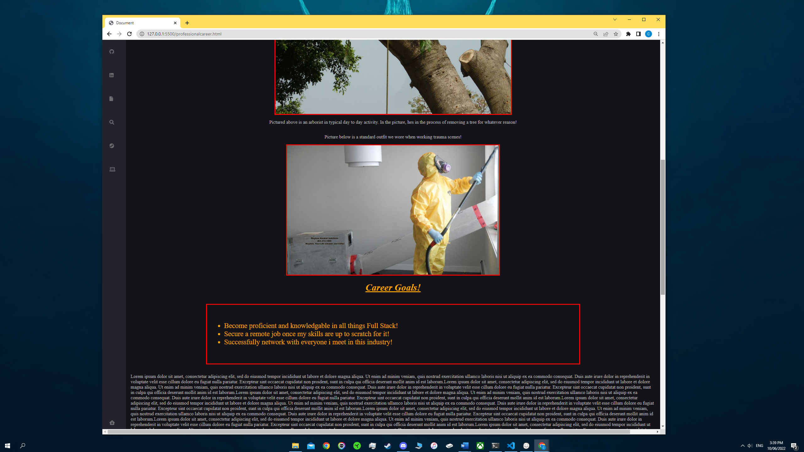
Here, on the professional career page, ive used unordered lists to display Career Goals!
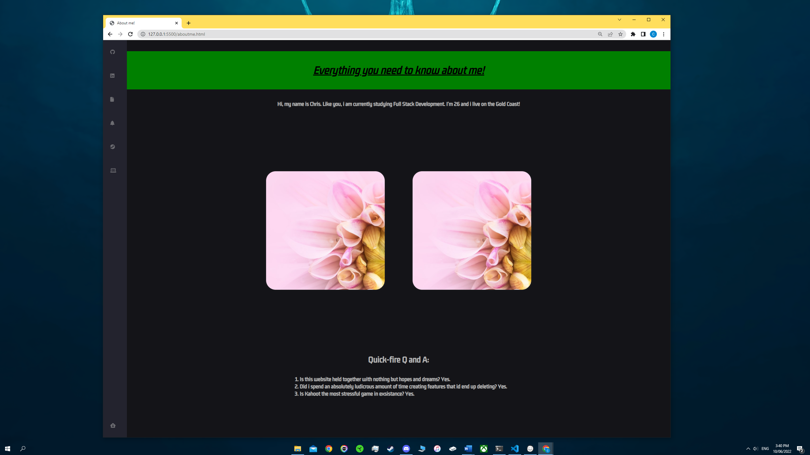
The about me page was a fun and challenging page to create. It features 5 divs. The parent div is not visible to the user. The remaining for are responsible for the front and back sides of the flip cards. When users hover over the cards, they flip to display text (Fun Facts!)
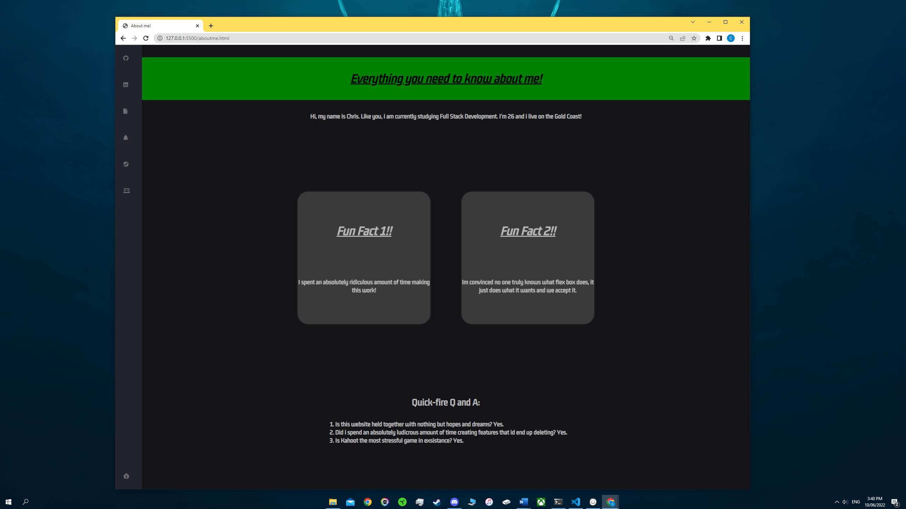
Backside of the flip cards.
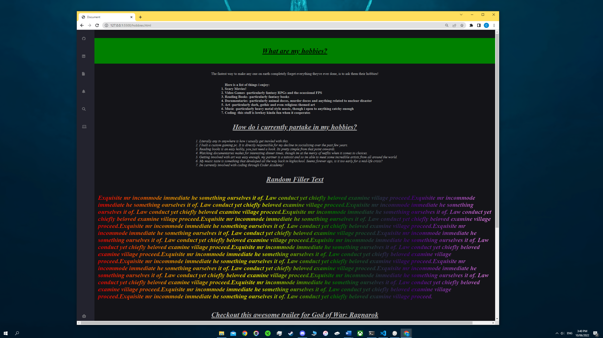
The hobbies page was a page i experimented with linear gradients and styling sections of text. The rainbow color text was a fun lesson. Would not necessarily be a very professional one however.
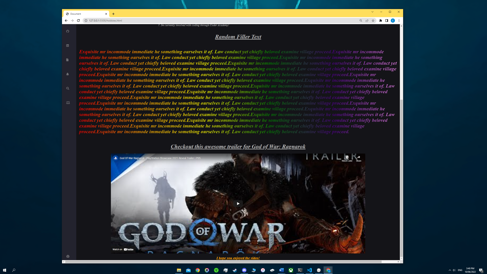
Down the bottom, theres an embedded link to a game im looking forward to. The trailer for the game is intended to be a bit of fun for the users.
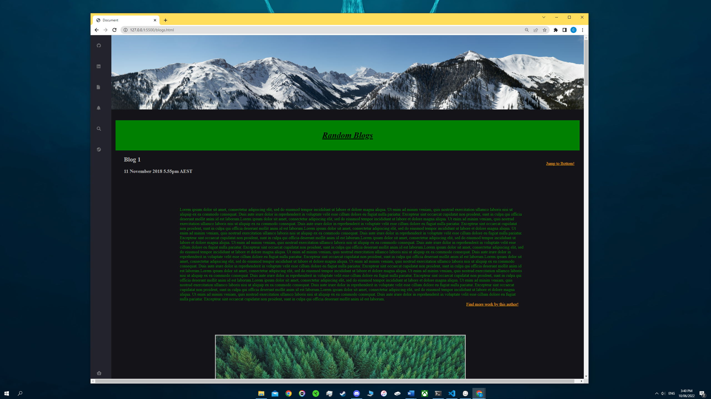
The blogs post is the most professional one, it has a very ordered layout, dates/times, images for each post and also links to external sites that pose as "more info about this blog" links.
It also has a header which was a great way to incorporate pictures in a new way!.
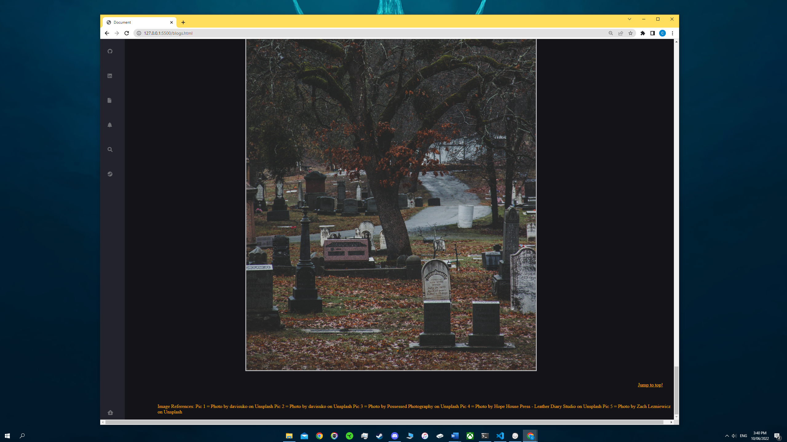
The footer of the blogs page is where i have credited the artists for their pictures. The images are free to use as long as you include their details on the page!!
This page also has a different style of link that users can use to "jump" from top to bottom and vice versa.

# **Target Audience**
The target audience for the site according to the criteria is supposed to be potential employers. I tested my skills and have decided im not in a position to create a professional website that is deployable and ready to send to employers. Instead, i used this opportunity to push my skills and design ideas. As such, the targeted audience is incredibly broad but it is mainly aimed at the class itself and myself. The site is intended to perform as a trackable development of my own skills. Regardless, i kept content light and familiar to me so that anyone on the site can quickly become aware of my hobbies, interested and skills.
# **Tech Stack**
This website was created with HTML, SCSS and CSS. (SCSS automatically transpiled the code into CSS)

# **Components im presenting for assessment**

## **Implement 4 HTML Documents:**
I am presenting 6 HTML documents for assessment as well as a single SCSS sheet that has automatically transpiled itself into CSS. The pages for assessment are:  
-Github external link  
-Linkedin external link  
-Resume HTML page  
-Professional Career HTML page  
-About me HTML page  
-Hobbies HTML page  
-Blogs HTML page  
-Styles.scss page  

## **Implement 4 Text Components:**
I will be presenting 4 text components for assessment:  
-Resume page has 4 colored divs responsible for displaying text. I am presenting it as 1 text component.   
-The resume page also has text included in section tags but formatted as part of the overall body. The text here is simple, contains headings, size adjustments, formatting adjustments and is responsive. I am submitting this as 1 component. 
-About me page has 2 flipcards that animate to display text on the rear side, i am presenting that and 1 text component.  
-The hobbies page has a section tag targeted in SCSS, the text has been formatted and styled in multiple ways. It is the section displaying as rainbow text. I am presenting this as 1 Text component.

## **Implement 4 Graphical Components:**
The 4 graphical components i am submitting for assessment are:  
-Resume page; the 2 flipcards are formatted significantly to display 2 pictures on the front of the cards. I am submitting the flipcard pictures as 1 component.  
-The blogs page has a header formatted to hold and display an image. I am submitting it as 1 component.  
-The blogs page also has 5 images formatted in the body inside section tags. These images have an added scale and hover effect. I am submitting the 5 pictures as 1 component.  
-The homepage has 2 pictures that are formatted alongside text. They also have added hover functionality and custom sizing/responsivness. I am submitting the 2 pictures as 1 component.

## **Create a responsive layout:**
My website utilises Flexbox, %, rem, vh, vw and px to ensure maximum responsivess. The website has breakpoints that target Mobile, Tablet and Desktop Mode. The breakpoints are at the very end of my SCSS sheet if you want to see them.

## **Special notes:**
I have tried to select components that differed from one another as significantly as possible. My website incorporated a simple design and i personally enjoy centered structured content. Because of this, a lot of my website took advantage of variables, mixins and broad class tags. If you decide one of my components isnt up to scratch, please feel free to have a look at the others. 