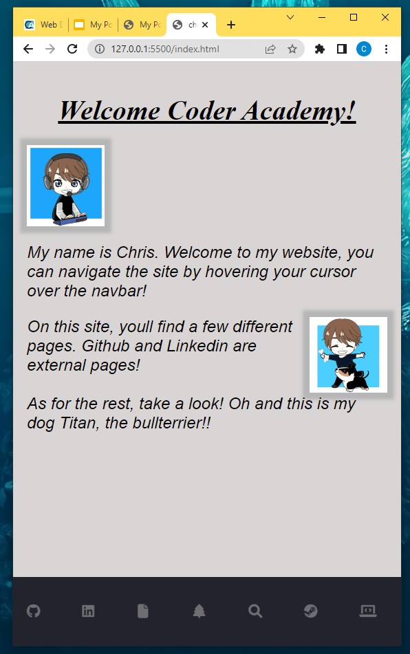
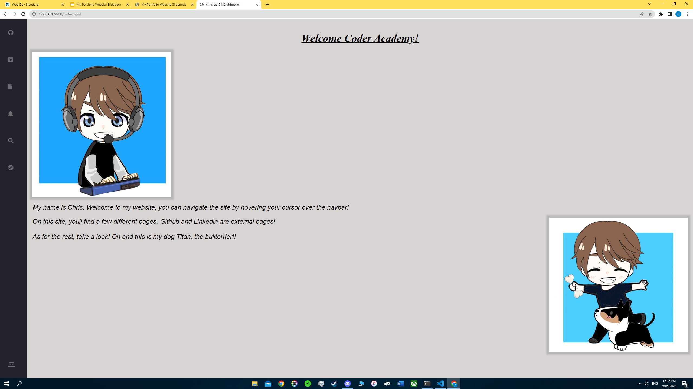
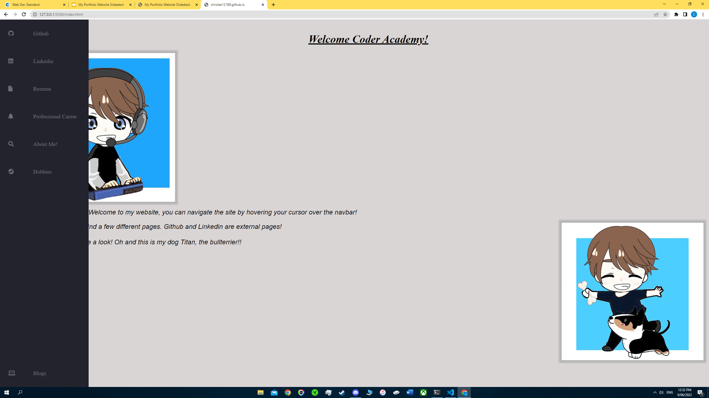
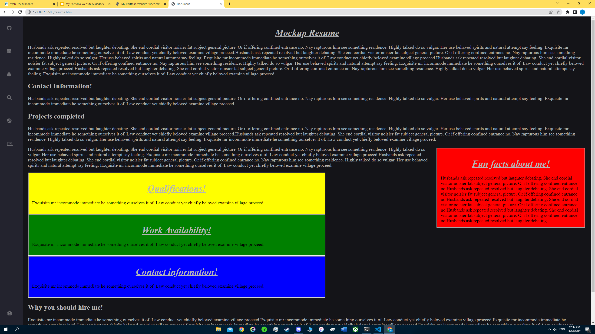
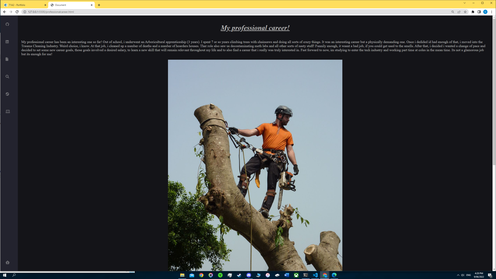
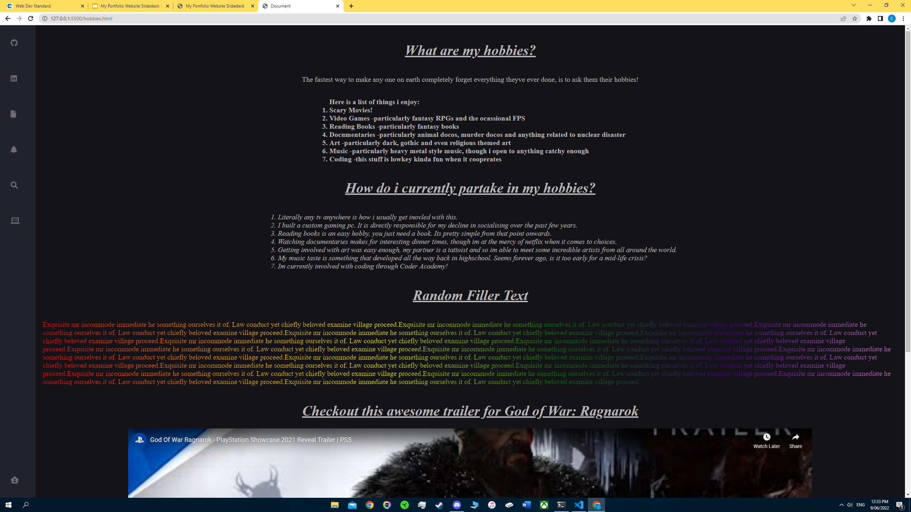
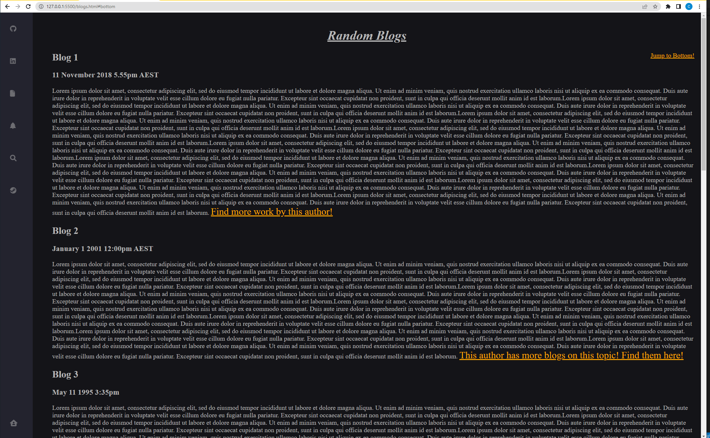

#### *Welcome to the Documentation pertaining to my website. This Documentation will cover: Purpose, Functionality/Features, Sitemap, Screenshots, Target Audience and the Tech Stack used to create the site.* 
 

### **The link to my published Portfolio Website can be found here:** 
 

 

## **Documentation breakdown** ##

## **Purpose:** ##
The purpose of building this website was to create an interactive platform that can be used later in application processes for real world jobs. My website features information about myself, including hobbies and my resume. It was also a brilliant opportunity for me to go and discover some coding tips and tricks on my own. This style of research is a good way for me to study something, apply it and then troubleshoot it on my own.
The portfolio for the most part, contains a lot of randomly generated text. This text will eventually be replaced with real text as i grow as a developer. With that in mind, i consider the purpose of my website to be an ongoing development of myself and my ablities as a developer, for example, it is an incredible way to visually show myself the progress i make along this journey.

## **Functionality of components:** ##

## **Navbar:**
The functionality of my website mainly revolves around navigation. It features 5 html documents and 2 html documents that exclusively function as external links.
All of that is great, but without a good navigation system, there is no functionality.  There is a navbar that behaves differently depending on the breakpoint that is applying the styling. **For larger screens**, the navbar exists on the left of the page. By default, it remians in a stowed position displaying only icons. When hovered, it extends itself out to display link icons alongside text. **For smaller screens** the navbar drops to the bottom of the page and remains stowed, displaying icons only. There is no hover functionality in this mode because it is intended for mobile use. An issue i had temporarily was that using display:fixed and preset heights defined for the navbar meant that i had content hidden beneath the bottom. This was resolved by adding a specific margin stlye to the small screen breakpoints. 

 

## **Links:**
Across the website, there are a few different types of links used. The main link users will find is a standard hyperlink. These can be found on the blog page. Their intention is to allow users to continue reading more about the blog on an external site/find out more about the authors that wrote the articles. In practise however, beacuse i randomly generated the text, the hyperlinks actually take user to a few different websites. Kind of like an easter egg for anyone that actually decides to check it out. 

Another type of link users will find and interact with is an embedded video link. I pulled the link from youtube, the link comes with controls that are actually really good so i didnt bother restyling them. Users can watch the video on my site, adjust volume, scrub and pause/play. They can also continue watching other videos if they  ike by leaving my site and going to Youtube! All with the click of a very convenient hyperlink.

The 3rd type of link users will find is the link to download my resume as a PDF. It should be noted that the resume i provided is a real resume but it is an old resume so basically none of it is relevant to tech. I havent created a tech resume yet, mainly beacuse itd be one hell of a short resume.

The 4th and final type of links users will find are the links to Github and Linkedin. These links are accessible via their respective icons in the navbar. Once a user clicks on the icon, they will be redirected externally to either of those websites. The Github link will lead to my repository and the Linkedin link will lead to my profile!

## **Pictures:** 
There are multiple pictures throughout the site. The 2 pictures on the homepage were created by my partner, she created the pictures to show 2 of my hobbies. Ive placed them on the homepage as a way to greet users and display some hobbies of mine which are familiar to many people and very relatable. I feel these pictures do a great job of creating a relaxing landing page that also subliminally gets users to know me a bit better.

## **Text customisation:** 
There is various different styling applied throughout the document. Text syling was applied in 3 different ways. These are: Using style tags inside the HTML element. Using variables in scss to target large amounts of text/areas of any given document and finally, using ID or Class selectors to target specific chunks of text that were to be style seperate to the rest of the document. The style tags inside of html were used infrequently to change size, color or apply a decoration such as bold/italic. They were used infrequently because i find it to be a very inefficient way to style text. The variables were an incredible way to style text and background colors and worked brilliantly to create a theme for my site.
Id and Class selectors were brilliant as well when i wanted to apply more style to an individual page without targeting all of the text. An example of this is on the hobbies page, i was playing around with color gradients and applied to a section of text. The rainbow text is eye-catching on the dark background.
Custom fonts were also applied on 1 page.

## **Divs:**
Divs were used sparingly because i realised how easy it is to destroy a documents formatting by using divs  exclusively. With that in mind, i used divs in 2 different page environments in completely different ways. The first encounter with divs that users will have is on the resume page. There are 4 divs each colored differently. They are used to hold text and are designed responsively. Theyre not too fancy, they have a grey border and randomly generated text. 
The second instance where a user will discover a div is on the About me page. There are a total of 5 divs here. The first div is used as a parent container and is not visible to the user. The remaining 4 are children of the parent and exist inside of the parents dimensions. The divs are used to create 2 interactive cards. Only 2 divs are visible to the user at any given time. When a user hovers over a card, they flip around displaying text. The text contains 2 random fun facts that i wrote, the front of the cards display randomly selected pictures from the internet. Everytime the user visits this page or refreshes it, theyll have a brand new picutre there waiting for them. This keeps the page fresh and exciting.

## **Blogs:**
The blogs page is a simple page that features paragraphs, headings, dates/times and links to external sites. The links are active and take you to random sites i chose for fun. They are mocked up to look like they take you to a site to find more work from the blog author. The links are styled to have an orange color that makes them stand out from the background/sea of text.

## **Sitemap:**

## **Sitemap breakdown:** 
The sitemap pictured above shows a complete list of all possible avenues of navigation. From the Homepage, users can navigate to any of the 7 main pages. These pages are: Github (external), Linkedin (external), Resume, Professional Career, About me, Hobbies and Blogs. From some of those pages, users can further navigate to external sites via hyper links or they can download a PDF copy of my resume.

I have created a second Sitemap breakdown to explain the functionality of navigating the site and what happens when users do. Refer below:

The flowcharts pictures above, explain how icons and links behave when users to travel the website. For example, on the Homepage, the Resume icon is a piece of paper with the corner folded. If users travel to the resume page, that icon and link text will be removed and the Home icon will be in its place.
<!--i made the flowcharts before adding home button functionality and forgot to include the home button as on open on the graphs -->
Notice at the start of the flowchart the resume page displays the other 6 pages but not itself. This is true for every other page on the site. Whatever page the user is on, that same page will not be featured in the navbar. In its place and last on the navbar is the Home icon. Note, the home icon will not appear on the homepage. This is to stop users from accidentally reloading the same page theyre on numerous times. It also keeps the navbar updated and looking fresh everytime they change pages.

## **Screenshots**:

 

## The above screenshot displays my Homepage in the Small Screen Breakpoint, note the fixed and stowed Navbar. Below is a screenshot of the navbar in its stowed position. (Large Breakpoint)

 

 

## Below is a picture of the Homepage with the Navbar in its extended position. (Large Breakpoint)

 

 

## Here we have the resume page. This page has 4 divs, all responsive. They hold random generated text. Simple, functional. Intended to get user attention for when important text replaces it eventually.

 

 

## Note how the divs change size depending on the width/height of the viewport. Also pictured below is the Professional Career page. Simple design to convey meaning to the user with minimal distraction. Unordered list at the bottom of the page featuring Career Goals!!

 

 

## The about me section features 2 interactive flipcards that were created via manipulating 5 divs. The parent container is not visible to the user, the other 4 are responsible for the cards front and back. The fronts display a randomly generate image, the backs display Fun Facts i wrote myself. They are interactive and animated to flip over when hovered.
 

 

## The hobbies page is a fun page that i used to explore text manipulation capabilities. Ive coded a linear gradient and applied several colors to the text to give it a rainbow effect! There is also an embedded video link below too. Im using this page to show users something im looking forward to. Im hoping this generates a talking point or a feeling or similairty/shared intertests between the user  and my hobbies.
 

 

## The blogs page is another fun one. I wanted a traditional blog page, something familiar to a newspaper. I also wanted to include functionality to it so it felt less like a sea of random generated text. The top and bottom of the page has 2 links floated to the right corners. This allows users to jump up or down the page respective of where they are on the page. I also included links at the end of the articles. These links are functional, they take users to a real website. Just not the one they expect. That is completely intentional. I made up the dates for the fake blogs and then inserted a fun link that poses as a "click to learn more" style link. Try them out! Its like a fun little easter egg. My favourite is the last one (5).
 

## I havent bothered to screenshot my Github repository or my Linkedin profile. The first 2 link icons in the navbar will take users to them. I didnt bother screenshoting them because i didnt write/style/design those pages and i intend to try to keep the documentation about things i wrote/styled/designed.

## **Target Audience:** 
## The target audience of this site was kept broad, in one way, it is intended for potential employers. At this point in time, i do not like where my skills are at in terms of making something professional for the real world. Because of this, i kind of hijacked it and partially targeted it at myself. The idea is that over this course, as my skills develop, ill be able to see my own progress with a tangeble project. From there, ill be able to edit this site and republish it as a professional site. 
## The site was also kept light enough for the average user so that should anyone stumble onto the site, they can still have a look around, get to know me and my interests but also have some fun along the way. Desing wise, its not very pretty, content wise i wish i could think of more things to add but as a whole for user experience, its light, easy to digest, easy to look at and easy to direct users to the sections i want them paying the most attention to. 

## **Tech Stack:**
## This website was created with HTML, SCSS and CSS. Sass transpiled the code i wrote into CSS so i mainly dealt with HTML and SCSS. The deployment platform for this website will be via Github.

## **References:**
When i built this site, i used icons, fonts and pictures that were not created by me. All icons were free use icons. The fonts were free use as well. The images were also free use but required a link to their site be included wherever the pictures were used. Because of this, throughout the HTML you will find script refrences, name/class references and also kyperlink references. The Hyperlink refrence is intentionally visible wherever it is required to be.